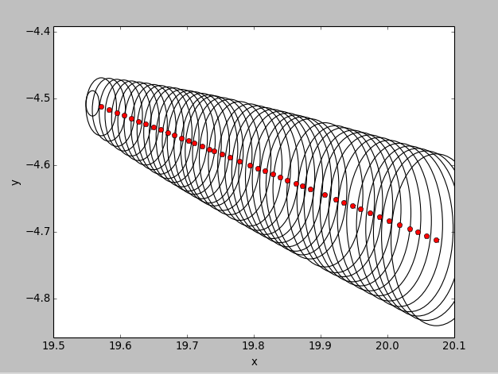

# turtlebot_ekf
Tutorial to understand how an ekf is used on a real robot for localization. 

# NOTICE: This is an unfinished tutorial!

To launch the ekf in Gazebo: 

> roslaunch my_tutorial simulation_ekf.launch

To launch on the real Turtlebot: 

> roslaunch my_tutorial ekf.launch

## Overview
Robot kinematics, which is what this tutorial is generally about, has been studied thoroughly in the past decades. 
However, it has almost exclusively been addressed in deterministic form. Probabilistic robotics generalizes kinematics 
equations to the fact that the outcome of a control is uncertain, due to control noise or un-modeled external effects; which is almost certainly always the case when it comes to robot motion in reality. 

This tutorial attempts to understand and simply the complex concepts of robot motion in a very specific setting with the hope of making the 
material easier to grasp. 

## Problem Formulation: 

The tutorial implements an EKF algorithm on a Turtlebot2 robot. 
Two sensors are used: 
  * Turtlebot's own odometry data
  * Kinect camera mounted on the Turtlebot. 
No additional sensors are being used, such as GPS, external camera, etc. 

The measurements are performed indoors. 

There are no moving objects when data is collected. 

Data is collected in real-time, but there is no real-time demand on reaching a goal position. 


## Preliminaries: 

### Robot Motion

* Kinematics: The calculus describing the effect of control actions on the configuration of a robot.
* Configuration: The configuration of a rigid mobile robot is commonly described by six variables, its 
                 three dimensional Cartesian coordinates and its three Euler angles (roll, pitch, yaw) relative to an external coordinate frame
                 In this tutorial, we are working with the mobile Turtlebot operating in a planar environment, so the kinematic state is summarized 
                 by three variables, referred to as pose.
* Pose: The pose of the robot is described by the 3x1 vector: <x, y, theta>
  * Bearing or heading: The orientation of a robot is often termed bearing or heading
                          In this tutorial, we postulate that a robot with orientation theta = 0  points into the direction of the global x axis and a robot with an 
		                      orientation of theta = pi/2 points in the direction of its y axis.
  * Location: location refers to the robots pose without taking into account orientation, described by the 2D vector: <x,y>
* Kinematic state: The pose and the location of the robot and other objects in the environment may constitute the kinematic state (x_t) of the robot-environment system
* NOTE: x and x_t should not be confused. x refers to a coordinate while x_t is a state that consists of coordinates (x,y,theta)

* Motion model: In probabilistic terms it is the state transition model. In general terms, motion models are used to calculate the velocities based on pose estimate, new pose, and time elapsed. In this tutorial, the control command is a 2x1 vector <v, w> where v is linear velocity and w and angular velocity.

### Robot Perception: 

* Measurement: Usually sensor readings generate more than a single numerical value. More often than not, the sensor reading consists of an array of values. Depending on the type of sensor data being measured, different mathematical models are used to model the sensor readings: z_t = f(x_t); where f(x_t) depends on the type of data being measured. 
* Sensor error: Every sensor has inaccuracies associated with it. The measurement model is in the form: z_t = f(x_t), a probabilistic density p(zt | xt) with a covariance Q_t. We are trying to find the best estimate, because the robot is basing all of its decisions on the estimate. Therefore we must account for the error. We can find this through measurements. Since we are using the kinect laser scan data, we can use the [kinect accuracyy](http://wiki.ros.org/openni_kinect/kinect_accuracy) available on the ROS wiki page. 
* motion model: Measurement models are used to estimate pose and find the new robot pose based on previous knowledge of the state, a prediction based on the controller commands, and the time elapsed. Our model uses odometry information published by the Turtlebot. We are trying to determine the following with pose estimation: 
	*the position of the robot relative to the world/map
	*the direction of the robot relative to the world/map
	*the distance to obstacles 
	*the direction to obstacles

In general, each time our robot takes measurements with its sensors, it uses these measurements to update its internal estimate of the state of the world. It compares this state to a reference value of what it wants the state to be, and calculates the error between the desired state and the actual state. Once this information is known, generating new control signals can be reduced to a problem of minimizing the error.

### A Simple Model

First, our robot will have a very simple model. It will make many assumptions about the world. Some of the important ones include:

    * The terrain is always flat and even
    * Obstacles are never near
    * The wheels never slip
    * Nothing is ever going to push the robot around
    * The sensors never fail or give false readings
    * The wheels always turn when they are told to

## Extended Kalman Filter

Based on available information (control inputs and observations) it is required to obtain an estimate of the Turtlebot's state that optimizes a given criteria. This is the role played by the Extended Kalman Filter (EKF). 

### Initialization

The first step is to initialize our filter based on prior knowledge of the state. We assume that we know exactly where the Turtlebot is in the world at the start of measurement, so we initialize everything to zero. 

```
# PRIOR KNOWLEDGE OF STATE
predicted_state_est = 0
predicted_covariance_est = 0
state_trans_uncertainty_noise = 0
measurement =	0
ave_meas_dist = 0

```
### Prediction Step

The next step is to make a prediction about where the Turtlebot currently is based on our previous knowledge of the state and the control commands given to the Turtlebot wheels. This is easy to obtain via the /odom topic published by the base nodelet manager. 

1. Create a subscriber that listens to the /odom topic

```
rospy.Subscriber('odom', Odometry, odom_state_prediction)

```
2. The odometry data published is a standard message with 7 configuration variables: x, y , z and quaternions.The next step is to extract the three configuration variables that describe our system: x, y, yaw (our model's configuration).

We can use the tf.transforms euler_from_quaternion function in order to get the yaw in eu 

```
	# Get the yaw (theta) from the quaternion using the tf.transformations euler_from_quaternion function. 
	(roll,pitch,yaw) = euler_from_quaternion([odom_data.pose.pose.orientation.x, odom_data.pose.pose.orientation.y, odom_data.pose.pose.orientation.z, odom_data.pose.pose.orientation.w])
	x = odom_data.pose.pose.position.x
	y = odom_data.pose.pose.position.y

```

3. The final part of the prediction step is to quantize the error in our prediction: 

```
# UNCERTAINTY INTRODUCED BY STATE TRANSITION (MEAN = 0, COVARIANCE PUBLISHED BY ODOM TOPIC: )
	# Odom covariance matrix is 6 x 6. We need a 3 x 3 covariance matrix of x, y and theta. Omit z, roll and pitch data. 
	state_trans_uncertainty_noise= numpy.array([[odom_data.pose.covariance[0],odom_data.pose.covariance[1],odom_data.pose.covariance[5]],[odom_data.pose.covariance[6],odom_data.pose.covariance[7],odom_data.pose.covariance[11]], [odom_data.pose.covariance[30],odom_data.pose.covariance[31],odom_data.pose.covariance[35]]])
	
	# Define the state transition jacobian. 
	state_transition_jacobian = numpy.array([[1,0,0],[0,1,0],[0,0,1]])
	
	# Calculated the total uncertainty of the predicted state estimate
	predicted_covariance_est = state_transition_jacobian*predicted_covariance_est*numpy.transpose(state_transition_jacobian)+state_trans_uncertainty_noise

```

### Measurement Update Step

After a prediction has been made on the current pose, we use measurement information to update our prediction. Our simple model uses kinect scan data to measure the distance of the Turtlebot from the wall. 

1. Subscribe to the /scan topic published by the pointcloud_to_laserscan package: 

```
rospy.Subscriber('scan', LaserScan, kinect_scan_estimate)

```

2. For simplicity, we average 20 measured distances in the middle of the sensor range (pointing directly in front of the Turtlebot's vision) .

```
# Average measured range/distance of 20 samples from sample 310 to 330 (out of a total 640 samples)
	sum_dist = 0
	length = 0
	#for i in range (310, 330):
	for i in range (580, 600):
		if str(measurement[i]) != 'nan' :
			sum_dist += measurement[i]
			length += 1 

	if length != 0: 
		ave_meas_dist = sum_dist/length

```

3. The next step is to find the difference between our prediction and the measurement information. In order to do so, we must calculate the measurement that we expect to get if our prediction is accurate. This expected measurement is subtracted from the actual measurement to give us a residual.  

```
# Calculating the measurement we expect to get based on received odometery data. 
	expected_meas = numpy.cross(numpy.array([0, 1, 0]), numpy.array([predicted_state_est.x, predicted_state_est.y, predicted_state_est.th]))
	
	#innovation or measurement residual: The difference between our actual measurement and the measurement we expected to get. 
	meas_residual = ave_meas_dist - expected_meas

```

4. We also find the uncertainty inherent in our residual calculation: 

```
#innovation or measurement residual: The difference between our actual measurement and the measurement we expected to get. 
	meas_residual = ave_meas_dist - expected_meas

	#Account for the measurement noise by adding error 
	meas_noise_covariance = 0.005

	# Measurement jacobian: 
	H = numpy.array([[9999, 0 , 0],[0, 1, 0],[0 , 0, 9999]])

	# Innovation (or residual) covariance
	residual_covariance = H*predicted_covariance_est*numpy.transpose(H)+meas_noise_covariance

```

5. We now have enough information to find the best estimate of the state using our knowledge of the system model, measurements, and including uncertainties: 

```
# Near-optimal Kalman gain: Amalgamating all the uncertainties
	kalman_gain = predicted_covariance_est*numpy.transpose(H)*numpy.linalg.inv(residual_covariance)

	# Updated state estimate
	updated_state_estimate =  numpy.array([predicted_state_est.x, predicted_state_est.y, predicted_state_est.th]) + numpy.dot(kalman_gain, meas_residual)


```

6. Finally, we calculate the uncertainty of our final best estimate: 

```
# Updated covariance estimate
	predicted_covariance_est= (numpy.identity(3) - numpy.cross(kalman_gain,H))*predicted_covariance_est

```

## Reference Provider

Every time the controller requests a pose, the reference_provider will respond. For now, the response of the reference_provider is a Config variable where the x and theta are the same as the current robot pose, and the y coordinate is incremented by 1 mm, so the robot moves in a straight line along the wall. 

```
# Only move in the y direction in 1 mm increments. 
	x_desired = x_now
	y_desired = y_now + 0.1
	th_desired = th_now

	# Package desired state in a custom message of type 'Config' 
	desired_state = Config(x_desired, y_desired, th_

```

## Motion Model

This is the controller.The control command consists of linear and angular velocities that are sent to the Turtlebot's wheels. These velocities are calculated using kinematics equations of motion, once the best estimate of the state is received from the motion model, and the reference provider has given a next desired state.

```
	# calculating velocities: 
	x_dot = (desired_state.x - x_est)/dt
	y_dot = (desired_state.y - y_est)/dt
	th_dot = (desired_state.th - th_est)/dt


	linear_vel = sqrt(x_dot**2 + y_dot**2)
	angular_vel = th_dot

```

The time step dt is the time from when the previous command was sent to the time now when the command is being calculated. 


## Plotting the filter behavior 

We can get an idea of how the filter works by plotting the measurement and associated covariances. 

```
# Plot the covariance
	# I expect the updated covariance to decrease in the direction of measurement and increase in the 
	# direction that I am not taking any measurements.  

	lambda_pre,v=numpy.linalg.eig(pre_cov_store)
	lambda_pre = numpy.sqrt(lambda_pre)

	ax = plt.subplot(111, aspect = 'equal')

	for j in xrange(1,4):
		ell = Ellipse(xy=(numpy.mean(x_predict),numpy.mean(y_predict)), width=lambda_pre[0]/(j*19), height=lambda_pre[1]/(j*10),angle=numpy.rad2deg(numpy.arccos(v[0,0])))

	ell.set_facecolor('none')
	ax.add_artist(ell)

```



The red dots represent the x-y pose of the robot, and the black ellipse is the measurement uncertainty.  
The robot drifts in the y direction even though it thinks that it is going in a straight line. The uncertainty ellipse increases slowly in the y-direction (where no measurements are being taken). Also similar to the original plot,  my uncertainty in the x-direction decreases.


## Next Steps

This tutorial is not complete, and I intend on producing a usable learning tool for people new to robots. In order to get there, the following improvements need to be made: 

1. I wish to split the tutorial into several pages as opposed to one readme.md file. I would like it to be a step-by-step guide where theory is explained followed by easy to understand and illustrated application.

2. Implement a more robust measurement scheme:
	
Use tags for identifying obstacles and landmarks in the known map. 
Use an external camera, or connect an additional laser scanner to the turtlebot that aims at the ceiling for 2D planar measurement. 
Use the full range of the laser scanner as opposed to averaging 20 samples. 
Implement a less simplified measurement model, where first two and then all three of the pose configuration variables are being measured directly as opposed to only one indirectly. 
Try a more accurate measurement Jacobian and covariance calculations. 

3. Implement a more useful reference provider such as an A* path planner algorithm. I don't believe this would be too difficult to implement as I have written a working A* planner last quarter for “Robotic Manipulation”.  However, I would require a more accurate measurement node before I can successfully implement this.

## Helpful Links and Resources: 

https://vimeo.com/88057157

